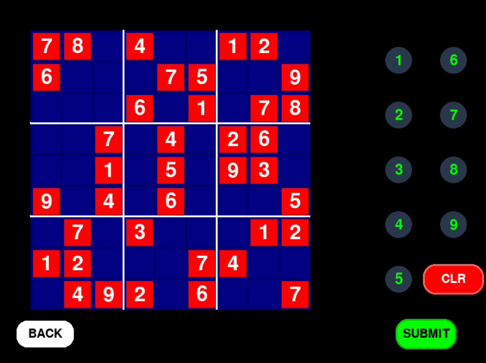

# SudokUwU

Sudokuwu is an interactive Sudoku application that allows users to either submit their own Sudoku board or have the app generate one. It employs image processing techniques and deep learning to form a Sudoku board from an uploaded copy. The interface is built using Pygame and features interactive elements like buttons, options selector, labels etc.

    
    

## Features

- Submit your own Sudoku board or let the app generate one.
- Uses image processing and deep learning to interpret and create Sudoku boards from uploaded images.
- Interactive interface with enlarging buttons for an engaging user experience.

## Requirements

- Python 3.x
- Pygame
- OpenCV
- PyTorch
